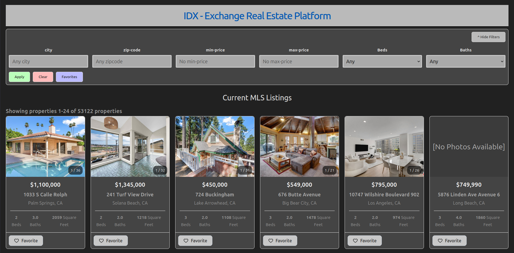

# IDX-Property-Search-Project

A Zillow/Redfin-style property search experience backed by real MLS data.

---
## Application Features

A property searh platform using real MLS data.

See property overviews and images right from the listings page.

View all properties and save your favorites by adding them to your favorites list.

Filter properties by your chosen filters to see only properties that you're looking for.

Click on a property and view details about it including: property description, an image gallery, upcoming openhouses, and it's location on Google Maps.
As well as get directions to the property from your location with the press of a button.



---
## Tech stack

### Frontend
- **Framework:** React v19.2.7
- **State/Routing:** React-dom v19.2.7, React-Router-dom v7.18.2
- **Icons:** lucide-react v1.28.0

### Backend
- **Runtime:** Node.js v24.17.0
- **Framework:** Express v5.2.1
- **Database Driver:** mysql2 v3.22.5

### Database & Infastructure
- **Database:** MYSQL 8.0
- **Containerization:** Docker v29.6.0, Docker Compose v5.1.4

### Testing & Development
- **Test Runners:** vitest v4.1.10, Jest v30.4.2
- **HTTP Testing:** Supertest v7.2.2
- **Code Quality:** ESLint v10.6.0

---

## Set up of local Database

MySQL running in Docker with both tables populated and queryable.

Set up local MySQL database containing open house and property information using Docker.

### 1. Install Docker Engine
Open the terminal (Ctrl + Alt + T) and run the following commands to download and run the official script:

`curl -fsSL https://get.docker.com -o get-docker.sh`  
`sudo sh get-docker.sh`

Confirm the installation (if this outputs the version, it's installed successfully):  
`docker --version`

### 2. Configure Non-Sudo Group
Add yourself to the docker group so you don't have to type sudo before every command:

`sudo groupadd docker`  
`sudo usermod -aG docker $USER`  
`newgrp docker`  

### 3. Create the Database Container
Rename the sample-compose.yml file to compose.yml:  
`mv sample-compose.yml compose.yml`

Navigate to /backend/ and open the compose.yml file in your preferred text editor (like vim):  
`vim compose.yml`

Update the MYSQL_ROOT_PASSWORD field inside the .yml file to be the password you want for your database container.  
MYSQL_ROOT_PASSWORD: [enter_your_password]  
*If using Vim, press Esc, type :wq, and hit Enter to save and exit.*

### 4. Get SQL Files
Download the sql files you will turn into tables in your database.  
Place the files in a directory called sql-files inside the /backend directory  
The files should be named: rets_openhouse.sql and rets_property.sql

### 5. Start the Container
Run the following command to build and launch the database container in detached mode:

`docker compose up -d`

### 6. Import SQL Datasets
Import the data files into the database. This will create a new table for each SQL file. 
> Note: This step may take around three hours depending on your computer's hardware specs.  

Use the -vv flag and grep to show a minimal progress log.

Import the properties data:  
`docker exec -i idx-mysql-local mysql -u root -p'your_password' -vv rets < ./sql-files/rets_property.sql | grep affected`

Import the open house data:  
`docker exec -i idx-mysql-local mysql -u root -p'your_password' -vv rets < ./sql-files/rets_openhouse.sql | grep affected`

### 7. Confirm Database Status
Access the interactive MySQL shell inside the container:

`docker exec -it idx-mysql-local mysql -u root -p`  
*Enter your root password when prompted*

Your terminal prompt should now display: mysql>  
Verify your tables by executing the following queries:

`SHOW DATABASES;`  
`USE rets;`  
`SHOW TABLES;`

Ensure both tables contain data (the counts should return non-zero numbers):  
`SELECT COUNT(*) FROM rets_property;`  
`SELECT COUNT(*) FROM rets_openhouse;`

> Troubleshooting: If either table returns 0, drop the failed table and re-run the import step:  
`DROP TABLE rets.[tableName];`

Verify you can query table layouts and structures successfully:

`DESCRIBE rets_property;`  
`DESCRIBE rets_openhouse;`  
`SELECT id FROM rets_property LIMIT 10;`  
`SELECT id FROM rets_openhouse LIMIT 10;`  

Once confirmed, exit the MySQL prompt:  
`exit;`

### 8. Verify Volume Persistence
Test stopping and restarting your environment to ensure data persists properly:

`docker compose down`  
`docker compose up -d`

### 9. Once volume Persistence has been varified log into mysql and run the following commands to add indexes to the tables to make searching more effcient.

1. Check that the indexes do not already exist:
run:
`SHOW INDEX FROM rets_property`

See that there are no indexes applied. If there are remove them by:  
`DROP INDEX index_name`

2. Add the correct, more effeciant, indexes to your table:

```
SET GLOBAL sql_mode = 'STRICT_TRANS_TABLES,ERROR_FOR_DIVISION_BY_ZERO,NO_ENGINE_SUBSTITUTION';
SET SESSION sql_mode = 'STRICT_TRANS_TABLES,ERROR_FOR_DIVISION_BY_ZERO,NO_ENGINE_SUBSTITUTION';
CREATE INDEX idx_L_ListingID ON rets_property (L_ListingID);
CREATE INDEX idx_city_id ON rets_property (L_City, id DESC);
CREATE INDEX idx_zip_id ON rets_property (L_Zip, id DESC);
CREATE INDEX idx_price_id ON rets_property (L_SystemPrice, id DESC);
CREATE INDEX idx_bed_bath_id ON rets_property (L_Keyword2, LM_Dec_3, id DESC);
CREATE INDEX idx_city_price_id ON rets_property (L_City, L_SystemPrice, id DESC);
```
---

## Setting up endpoints

### 1. Install Project Dependencies
Navigate to the root of the project where the Makefile is located using cd and run:

`make install`

### 2. Create .env file with your credentials for the backend
Create and open a .env file within your /backend directory:

`touch .env`  
`vim .env`

Populate the configuration values using your custom credentials:

```
PORT=5000
DB_HOST=localhost
DB_USER=root
DB_PASSWORD=[yourDatabasePassword]
DB_NAME=rets
```

* **PORT**: The network port for your backend server (Common defaults: 5000, 8000, 8080).
* **DB_HOST**: Host ip address. Use localhost if running Node locally outside of the Docker network.
* **DB_USER**: Database administrative user (default: root).

### 3. Create .env file with your credentials for the frontend

Navigate to your frontend directory in the terminal uisng cd.  
run the following commands:  

`touch .env`  
`vim .env`

Populate the configuration values using your custom credentials:

```
VITE_GOOGLE_MAPS_API_KEY=[your Google maps API key]
```

### 4. Launch Development Server
Navigate back to the root of the project and run:

`make start`

This make command will route all logs to /logs  
Check the logs for a connection succssess message in the backend logs.  
Upon a successful configuration, you will receive a database connection success message.

Open your web browser and hit the health check route to verify everything works:

`http://localhost:5000/api/health`

* **Expected Output:** An "OK" "CONNECTED" JSON or text response.
* **Troubleshooting:** If you see a Down: 500 "DISCONNECTED" status code, verify that your Docker container is actively mapping to port 3306 on localhost and check your .env credentials.

Once everything on the backend looks good visit:  
`http://localhost:3000`

This will bring you to the frontend.

Trouble shooting:

If there are errors or the frontend does not load stop the application by navigating to the root directory and running:  
`make stop`

Then try reinstalling dependencies by running:
`make install`

Then try starting the application again by runnging:
`make start`

Now when you vist the frontend everything should be working.  
If it is still not view the logs and look for an error and please report a bug on this repo so that I can fix it as soon as possible. The more detail you provide in the bug report the better.

---
## API endpoint reference

**Base URL:** `http://localhost:5000/api`

### 1. Get All Properties (Search and Filter)

Retrives a paginated list of properties with support for filtering by location, price, bedrooms, and bathrooms.

* **URL:** `/properties`  
* **Method:** `GET`  
* **Query Parameters:**

| Parameter |	Type   | Required | Description										|  
|-----------|----------|----------|-------------------------------------------------|  
| `limit` 	| `number` | Optional | Number of items per page (default: `20`)		|  
| `offset` 	| `number` | Optional | Starting offset for pagination (default: `0`)	|  
| `city` 	| `string` | Optional | Filter by city name (case-insensitive)			|  
| `zipcode` | `number` | Optional | Filter by 5-digit postal code					|  
| `minPrice`| `number` | Optional | Minimum system price (`>=`)						|  
| `maxPrice`| `number` | Optional | Maximum system price (`<=`)						|  
| `beds` 	| `number` | Optional | Minimum bedroom count (`>=`)					|  
| `baths` 	| `number` | Optional | Minimum bathroom count (`>=`)					|

* **Response (200 OK):**  
```json
{
  "pagination": {
    "totalItems": 25,
    "totalPages": 2,
    "currentPage": 1,
    "itemsPerPage": 20,
    "hasNextPage": true,
    "hasPrevPage": false
  },
  "property": [
    {
      "id": 1,
      "L_ListingID": "MLS_1001",
      "L_City": "Orlando",
      "L_zip": 32801,
      "L_SystemPrice": 350000,
      "L_Keyword2": 3,
      "LM_Dec_3": 2
    }
  ]
}
```

* **Response (400 Bad Request):**  
```json
{
  "error": "Bad Request",
  "messages": ["zipcode not a valid number"]
}
```

**Get Property Details**  
Retrives a row from the database of a single property by id and fallsback to L_ListingID

* **URL:** `/properties/:id`  
* **Method:** `GET`  
* **Query Parameters:**
| Parameter |	  Type		| Required |              Description									 |  
|-----------|---------------|----------|-------------------------------------------------------------|  
| `id`	 	| string/number |    Yes   | rets_property primary key, or fallback to L_ListingID		 |

* **Response (200 OK):**  
```json
{
  "id": 101,
  "L_ListingID": "MLS_101",
  "L_City": "Orlando",
  "L_zip": 32801,
  "L_SystemPrice": 420000,
  "L_Keyword2": 4,
  "LM_Dec_3": 3
}
```

* **Response (404 Not Found):**  
```json
{
  "message": "Property not found, check that the id is valid"
}
```
**Get Property Open houses**  
Retrives all open houses scheduled for a specific property

* **URL:** `/properties/:id/openhouses`  
* **Method:** `GET`  
* **Query Parameters:**

| Parameter |	  Type		| Required |              Description									 |
|-----------|---------------|----------|-------------------------------------------------------------|  
| `id`	 	| string/number |    Yes   | rets_property primary key, or fallback to L_ListingID		 |  

* **Response (200 OK):**  
```json
[
  {
    "id": 1,
    "L_ListingID": "MLS_101",
    "OpenHouseDate": "2026-09-10T14:00:00.000Z",
    "OpenHouseStartTime": "14:00",
    "OpenHouseEndTime": "17:00"
  }
]
```

* **Response (404 Not Found):**  
```json
{
  "message": "Property not found"
}
```

**Get properties batch**  
Retrives property details for multiple property IDs in a single request

* **URL:** `/properties/batch`  
* **Method:** `POST`  
* **Headers:** `Content-Type: application/json`
* **Request Body:**

| Field	    |	  Type		| Required |              Description				 |  
|-----------|---------------|----------|-----------------------------------------|  
| `ids`	 	| array[number] |    Yes   | Array of property IDs to querry		 |

* **Example Request Body:**  
```json
{
  "ids": [10, 20, 30]
}
```

* **Response (200 OK):**  
```json
{
  "property": [
    { "id": 10, "L_ListingID": "L10" },
    { "id": 20, "L_ListingID": "L20" }
  ],
  "totalItems": 2
}
```
---
## Database Schema

###Database name: rets

###table Names: rets_property, rets_openhouse

* **rets_property important columns**  
| Field             | Type           | Null | Key | Default |  
|-------------------|----------------|------|-----|---------|  
| id                | int            | NO   | PRI | NULL    |  
| L_ListingID       | varchar(255)   | YES  | MUL | NULL    |  
| L_Address         | varchar(100)   | YES  |     | NULL    |  
| L_Zip             | varchar(20)    | YES  | MUL | NULL    |  
| L_AddressStreet   | varchar(50)    | YES  |     | NULL    |  
| L_City            | varchar(50)    | YES  | MUL | NULL    |  
| L_State           | varchar(50)    | YES  |     | NULL    |  
| L_Keyword2        | int            | YES  | MUL | NULL    |  
| LM_Dec_3          | decimal(4,1)   | YES  |     | NULL    |  
| L_SystemPrice     | int            | YES  | MUL | NULL    |  
| LMD_MP_Latitude   | decimal(18,15) | YES  |     | NULL    |  
| LMD_MP_Longitude  | decimal(19,15) | YES  |     | NULL    |  
| L_Remarks         | mediumtext     | YES  |     | NULL    |  
| L_Photos          | longtext       | YES  |     | NULL    |  
| PhotoCount        | int            | YES  |     | NULL    |


* **rets_openhouse important columns**  
| Field            | Type         | Null | Key | Default |  
|------------------|--------------|------|-----|---------|
| id               | int          | NO   | PRI | NULL    |  
| L_ListingID      | varchar(255) | NO   | MUL | NULL    |  
| OpenHouseDate    | date         | NO   | MUL | NULL    |  
| OH_StartTime     | time         | NO   |     | NULL    |  
| OH_EndTime       | time         | NO   |     | NULL    |  
| OH_StartDate     | date         | NO   |     | NULL    |  
| OH_EndDate       | date         | NO   |     | NULL    |  
| all_data         | longtext     | NO   |     | NULL    |

* **Other Important table information**  
- L_ListingID is the for foreign key.  
	If you have a property and you want to get it's open houses get the open houses with the same L_ListingID as the property.
- This is not a comprhensive display of the table columns. These are what are the most important for the app functionality. To see the complete tables log into the database and run:
	`DESCRIBE [table_name];`

---
## Complete list of Makefile capabilities

I have created a Makefile for the project, this will allow the user / programmer to easily start and stop the application as well as redirects output to local log files rather than just printing them in the terminal.

Here's how to use it:  
1. Navigate to the root directory of the project, where the Makefile is located.  
2. Run the command corrosponding to the action you wish to take:  
	a. `make install` 	-> Install or update all needed project dependanies  
	b. `make testFront` -> Run the unit tests for the frontend of the project  
	c. `make testBack`	-> Run the unit tests for the backend of the project
	d. `make testAll`	-> Run all the unit tests for the project
	e. `make start` 	-> Start the database continer, backend server, and frontend server as well as redirect output to log files  
	f. `make stop`		-> stop the frontend server, backend server, and the database container  
	g. `make clearLogs`	-> Delete the contents of all the local log files  
	h. `make deleteLogs`-> Delete all the local log files

I hope to continue to add to this Makefile to make it even more powerful and give it the capability to do things such as start the project for the first time and even populate the database based on sql files that the user / programmer will put in a predefined directory. The goal would be to make databse set up more simple.

---

##Known Issues

- When returning to the property listings page from the property details page it will return the user to page 1 rather than the page they left off on.

---
